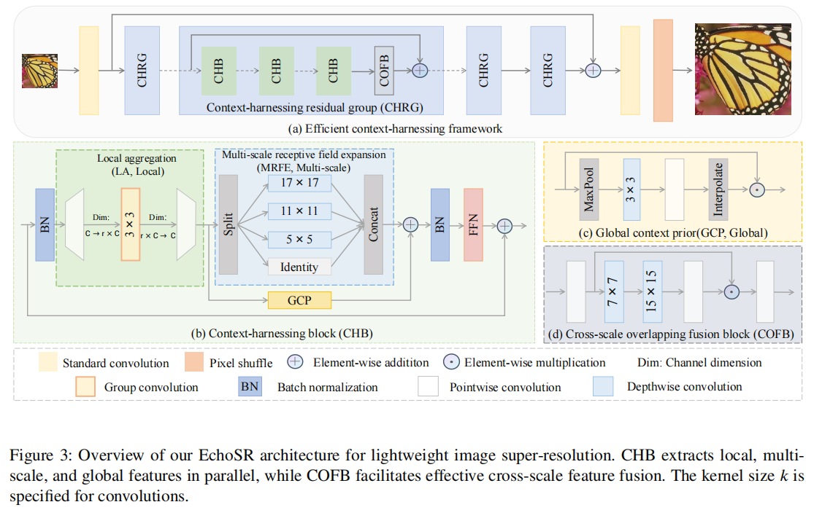
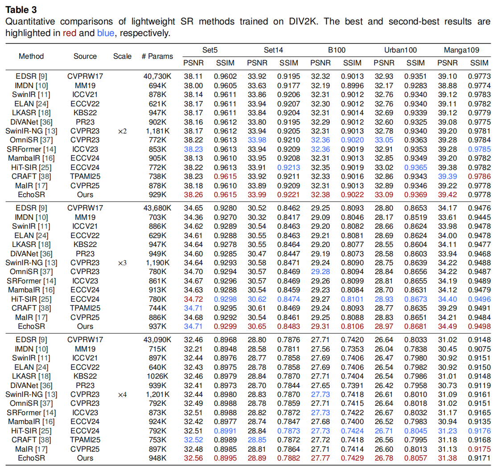
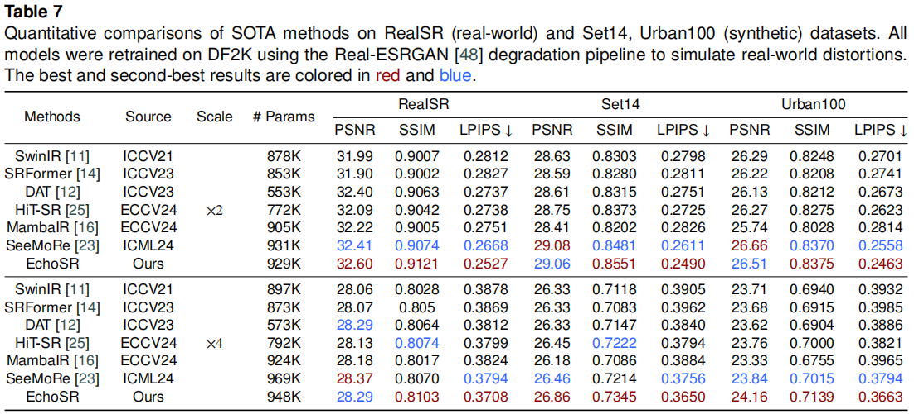

## EchoSR: Efficient Context Harnessing for Lightweight Image Super-Resolution [Information Fusion 2026 🔥🔥🔥 IF 15.5]

[paper](https://www.sciencedirect.com/science/article/abs/pii/S1566253526003507)

<p align="center">
  

  

[//]: # (  )
</p>

> **Abstract:** Image super-resolution (SR) aims to reconstruct high-quality, high-resolution (HR) images from low-resolution (LR) inputs and plays a critical role in various downstream applications.
> Despite recent advancements, balancing reconstruction fidelity and computational efficiency remains a fundamental challenge, particularly in resource-constrained scenarios.
> While existing lightweight methods attempt to expand receptive fields, many of them either incur substantial computational overhead, naively scale up kernel sizes, or lack mechanisms for coherent multi-scale integration, limiting their overall effectiveness and scalability.
> To address these limitations, we propose EchoSR, an efficient context-harnessing framework for lightweight image super-resolution, which unifies multi-scale receptive field modeling and hierarchical context fusion.
> EchoSR decouples feature learning into disentangled local, multi-scale, and global modeling stages through an efficient context-harnessing strategy, and further promotes seamless cross-scale integration via a cross-scale overlapping fusion mechanism.
> Extensive experiments have shown that EchoSR consistently outperforms state-of-the-art lightweight super-resolution methods across multiple benchmarks, while also achieving a faster speed $(\sim 2\times)$.

<p align="center">
    
</p>

## 📑 Contents

- [Model Summary](#model_summary)
- [Results](#results)
- [Installation](#installation)
- [Datasets](#datasets)
- [Training](#training)
- [Testing](#testing)
- [Citation](#cite)

## :page_with_curl: Model Summary

All pretrained weights, datasets, and visual results are available via [Baidu Netdisk](https://pan.baidu.com/s/1v515rjV4olk8vdBJ8jm0qA?pwd=Echo) (code: `Echo`).

### Classic Lightweight SR (DIV2K)

| Model           | Task              | model_weights                                                              |
| --------------- | ----------------- | -------------------------------------------------------------------------- |
| EchoSR_light_x2 | Lightweight SR x2 | [link](experiments/EchoSR_x2_light_Div2K/models/EchoSR_x2_light_DIV2K.pth) |
| EchoSR_light_x3 | Lightweight SR x3 | [link](experiments/EchoSR_x3_light_Div2K/models/EchoSR_x3_light_Div2K.pth) |
| EchoSR_light_x4 | Lightweight SR x4 | [link](experiments/EchoSR_x4_light_Div2K/models/EchoSR_x4_light_Div2K.pth) |

### Classic Lightweight SR (DF2K)

| Model           | Task              | model_weights                                                            |
| --------------- | ----------------- | ------------------------------------------------------------------------ |
| EchoSR_light_x2 | Lightweight SR x2 | [link](experiments/EchoSR_x2_light_DF2K/models/EchoSR_x2_light_DF2K.pth) |
| EchoSR_light_x3 | Lightweight SR x3 | [link](experiments/EchoSR_x3_light_DF2K/models/EchoSR_x3_light_DF2K.pth) |
| EchoSR_light_x4 | Lightweight SR x4 | [link](experiments/EchoSR_x4_light_DF2K/models/EchoSR_x4_light_DF2K.pth) |
| EchoSR_lite_x2  | Lightweight SR x2 | [link](experiments/EchoSR_x2_lite_DF2K/models/EchoSR_x2_lite_DF2K.pth)   |
| EchoSR_lite_x3  | Lightweight SR x3 | [link](experiments/EchoSR_x3_lite_DF2K/models/EchoSR_x3_lite_DF2K.pth)   |
| EchoSR_lite_x4  | Lightweight SR x4 | [link](experiments/EchoSR_x4_lite_DF2K/models/EchoSR_x4_lite_DF2K.pth)   |

### Real-world SR

Real-world SR weights are available via [Baidu Netdisk](https://pan.baidu.com/s/1v515rjV4olk8vdBJ8jm0qA?pwd=Echo) (code: `Echo`).

| Model          | Task             | model_weights                                                             |
| -------------- | ---------------- | ------------------------------------------------------------------------- |
| EchoSR_Real_x2 | Real-world SR x2 | [Baidu Netdisk](https://pan.baidu.com/s/1v515rjV4olk8vdBJ8jm0qA?pwd=Echo) |
| EchoSR_Real_x4 | Real-world SR x4 | [Baidu Netdisk](https://pan.baidu.com/s/1v515rjV4olk8vdBJ8jm0qA?pwd=Echo) |

## 🥇 Results

We achieve state-of-the-art performance on lightweight image super-resolution tasks. Detailed results can be found in the paper.

<details>
<summary>Evaluation on Classic Lightweight SR (click to expand)</summary>

<p align="center">
  
</p>
</details>

<details>
<summary>Evaluation on Real-world SR (click to expand)</summary>

<p align="center">
  
</p>
</details>

<details>
<summary>Evaluation on Effective Receptive Field (click to expand)</summary>

<p align="center">
  
</p>
</details>

<details>
<summary>Evaluation on Efficiency (click to expand)</summary>

<p align="center">
  
</p>
</details>

## :wrench: Installation

This codebase was tested with the following environment configurations. It may work with other versions.

- Ubuntu 20.04
- CUDA 11.7
- Python 3.8
- PyTorch 2.0.1 + cu117

### Installation via conda

```bash
cd EchoSR
conda env create -f environment.yaml
conda activate EchoSR
```

### Installation via pip

```bash
pip install -r requirements.txt
```

## 📊 Datasets

All datasets and visual results can be downloaded from [Baidu Netdisk](https://pan.baidu.com/s/1v515rjV4olk8vdBJ8jm0qA?pwd=Echo) (code: `Echo`), which includes: EchoSR classical SR visual results, real-world SR visual results, benchmark datasets (Set5, Set14, BSD100, Urban100, Manga109, RealSR test), and real SR pretrained weights.

The training and testing datasets used in our work are organized as follows:

| Task          | Training Set                                                                                                                                                                                                                                                             | Testing Set                                 |
| ------------- | ------------------------------------------------------------------------------------------------------------------------------------------------------------------------------------------------------------------------------------------------------------------------ | ------------------------------------------- |
| Classic SR    | [DIV2K](https://data.vision.ee.ethz.ch/cvl/DIV2K/) (800 training images) + [Flickr2K](https://cv.snu.ac.kr/research/EDSR/Flickr2K.tar) (2650 images) — [DF2K combined [download]](https://drive.google.com/file/d/1TubDkirxl4qAWelfOnpwaSKoj3KLAIG4/view?usp=share_link) | Set5 + Set14 + BSD100 + Urban100 + Manga109 |
| Real-world SR | DF2K                                                                                                                                                                                                                                                                     | [RealSR](https://github.com/csjcai/RealSR)  |

## :hourglass: Training

### Train Classic Lightweight SR

1. Download the training datasets and place them in `datasets/DF2K`. Download testing datasets and place them in `datasets/SR`.

2. Follow the instructions below:

```bash
# Lightweight SR x2 (DIV2K, 1 GPU)
python basicsr/train.py -opt options/EchoSR_train/train_lightx2_Div2K.yml --auto_resume

# Lightweight SR x2 (DF2K, 2 GPUs)
CUDA_VISIBLE_DEVICES=0,1 torchrun --nproc_per_node=2 --master_port=1234 \
    basicsr/train.py -opt options/EchoSR_train/train_lightx2_DF2K.yml --launcher pytorch

# Lightweight SR x3 (DF2K, 2 GPUs)
CUDA_VISIBLE_DEVICES=0,1 torchrun --nproc_per_node=2 --master_port=1234 \
    basicsr/train.py -opt options/EchoSR_train/train_lightx3_DF2K.yml --launcher pytorch

# Lightweight SR x4 (DF2K, 2 GPUs)
CUDA_VISIBLE_DEVICES=0,1 torchrun --nproc_per_node=2 --master_port=1234 \
    basicsr/train.py -opt options/EchoSR_train/train_lightx4_DF2K.yml --launcher pytorch

# Lite SR x2 (DF2K)
python basicsr/train.py -opt options/EchoSR_train/train_litex2_DF2K.yml --auto_resume
```

### Train Real-world SR

```bash
Use the SRRealModel in basicSR/model For training
# Real-world SR x2, 2 GPUs
CUDA_VISIBLE_DEVICES=0,1 torchrun --nproc_per_node=2 --master_port=1111 \
    basicsr/train.py -opt options/real/train/train_realesr_x2EchoSR.yml --launcher pytorch

# Real-world SR x4, 2 GPUs
CUDA_VISIBLE_DEVICES=0,1 torchrun --nproc_per_node=2 --master_port=1111 \
    basicsr/train.py -opt options/real/train/train_realesr_x4EchoSR.yml --launcher pytorch
```

## :smile: Testing

### Test Classic Lightweight SR

1. Download the testing datasets and place them in `datasets/SR`. Pre-trained weights are already in `experiments/`.

2. Update the dataset paths in `options/EchoSR_test/*.yml` to match your local setup.

3. Run testing:

```bash
# Classic lightweight SR
python basicsr/test.py -opt options/EchoSR_test/test_EchoSR_light_SRx2.yml
python basicsr/test.py -opt options/EchoSR_test/test_EchoSR_light_SRx3.yml
python basicsr/test.py -opt options/EchoSR_test/test_EchoSR_light_SRx4.yml

# DF2K variants
python basicsr/test.py -opt options/EchoSR_test/test_EchoSR_light_SRx2_DF2K.yml
python basicsr/test.py -opt options/EchoSR_test/test_EchoSR_light_SRx3_DF2K.yml
python basicsr/test.py -opt options/EchoSR_test/test_EchoSR_light_SRx4_DF2K.yml

# Lite variants (DF2K)
python basicsr/test.py -opt options/EchoSR_test/test_EchoSR_lite_SRx2_DF2K.yml
python basicsr/test.py -opt options/EchoSR_test/test_EchoSR_lite_SRx3_DF2K.yml
python basicsr/test.py -opt options/EchoSR_test/test_EchoSR_lite_SRx4_DF2K.yml
```

### Test Real-world SR

1. Download the real SR pretrained weights from [Baidu Netdisk](https://pan.baidu.com/s/1v515rjV4olk8vdBJ8jm0qA?pwd=Echo) (code: `Echo`) and place them in `ckpt`  or other place you want.

2. Update paths in `options/real/test/test_realesr_x2EchoSR.yml` and run:

```bash
# Real-world SR
python basicsr/test.py -opt options/real/test/test_realesr_x2EchoSR.yml
python basicsr/test.py -opt options/real/test/test_realesr_x4EchoSR.yml
```

### Test Comparison Methods

Config files for comparison methods are available in `options/real/test/` (DAT, MambaIR, SwinIR, HIT-SIR, SeeMoRe, SRFormer) and `options/testOthers/`.

## 📊 Model Analysis

ERF (Effective Receptive Field) visualization and model complexity analysis code can be found at `./analysis/ERF/` and `./analysis/model_zoo/`.

## 🥰 Citation

Please cite us if our work is useful for your research.

```
@article{ZHAO2026104471,
title = {EchoSR: Efficient Context Harnessing for Lightweight Image Super-Resolution},
journal = {Information Fusion},
pages = {104471},
year = {2026},
issn = {1566-2535},
doi = {https://doi.org/10.1016/j.inffus.2026.104471},
url = {https://www.sciencedirect.com/science/article/pii/S1566253526003507},
author = {Hanli Zhao and Binhao Wang and Shihao Zhao and Tao Wang and Kaihao Zhang and Wanglong Lu},
keywords = {Image super-resolution, Lightweight super-resolution, Context harnessing, Multi-scale feature fusion, Convolutional neural network},
abstract = {Image super-resolution (SR) aims to reconstruct high-quality, high-resolution (HR) images from low-resolution (LR) inputs and plays a critical role in various downstream applications. Despite recent advancements, balancing reconstruction fidelity and computational efficiency remains a fundamental challenge, particularly in resource-constrained scenarios. While existing lightweight methods attempt to expand receptive fields, many of them either incur substantial computational overhead, naively scale up kernel sizes, or lack mechanisms for coherent multi-scale integration, limiting their overall effectiveness and scalability. To address these limitations, we propose EchoSR, an efficient context-harnessing framework for lightweight image super-resolution, which unifies multi-scale receptive field modeling and hierarchical context fusion. EchoSR decouples feature learning into disentangled local, multi-scale, and global modeling stages through an efficient context-harnessing strategy, and further promotes seamless cross-scale integration via a cross-scale overlapping fusion mechanism. Extensive experiments have shown that EchoSR consistently outperforms state-of-the-art lightweight super-resolution methods across multiple benchmarks, while also achieving a faster speed ( ∼ 2 × ). The source code is available at https://github.com/funnyWang-Echoes/EchoSR.}
}
```

## License

This project is released under the [Apache 2.0 license](LICENSE).

## Acknowledgement

This code is based on [BasicSR](https://github.com/XPixelGroup/BasicSR) and [MambaIR](https://github.com/csguoh/MambaIR). Thanks for their awesome work.
